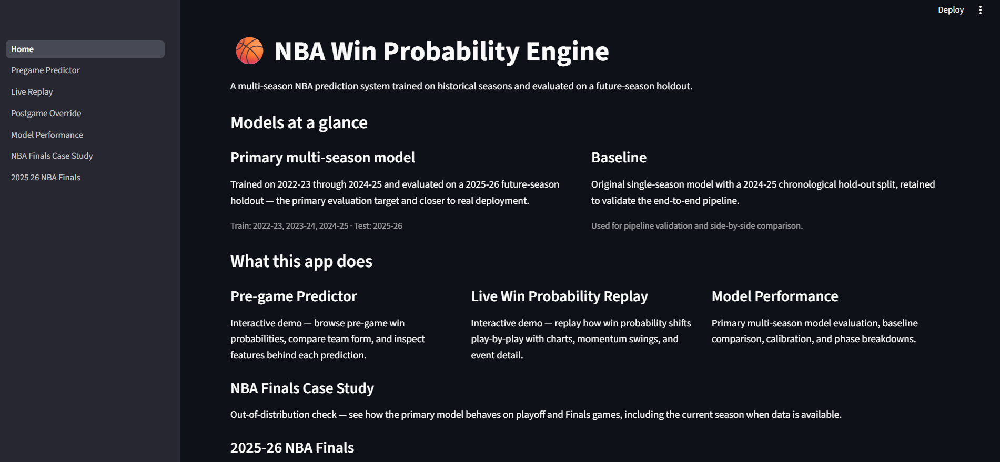
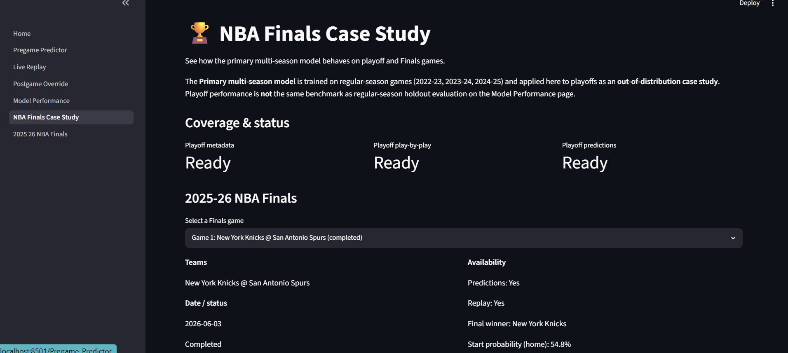
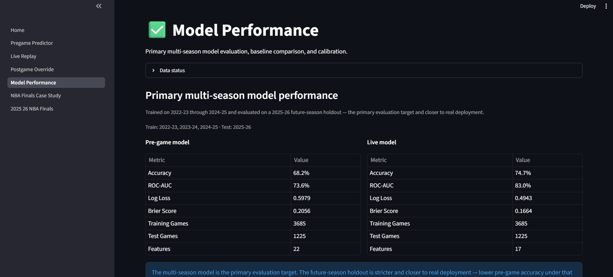
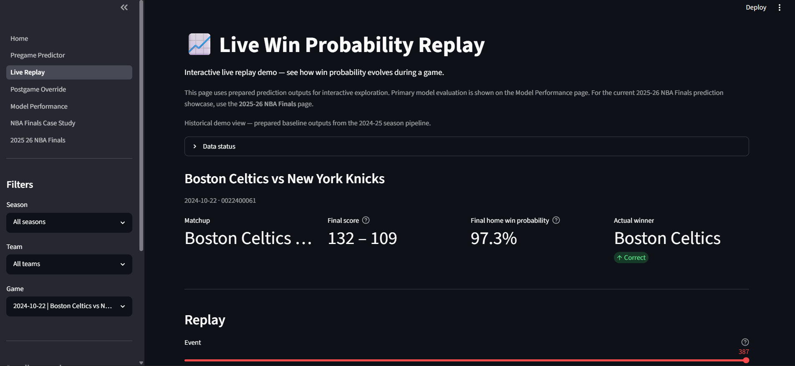
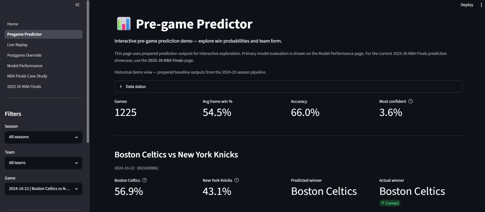

# NBA Win Probability Engine

A machine learning dashboard that predicts NBA game win probability before tip-off and during live play-by-play action.

## Live Demo

[NBA Win Probability Engine](https://nba-win-probability-engine.streamlit.app/)

## Overview

The NBA Win Probability Engine is an end-to-end sports analytics project that turns NBA game data into pre-game predictions, live win probability replays, model evaluation reports, and a Streamlit dashboard.

The main goal is to answer two questions:

1. Before the game starts, which team is more likely to win?
2. As the game unfolds play by play, how does the win probability change?

The project includes a full data pipeline, leakage-safe feature engineering, regular-season model training, model comparison, playoff case-study analysis, and a frozen 2025-26 NBA Finals retrospective.

## Project Highlights

* Built a repeatable Python pipeline for NBA data collection, cleaning, feature engineering, modeling, scoring, and reporting.
* Trained the primary model on 2022-23, 2023-24, and 2024-25 regular-season games.
* Tested the primary model on the 2025-26 regular season as a future-season holdout.
* Created both pre-game prediction and live play-by-play win probability workflows.
* Added a Streamlit dashboard for exploring predictions, live replay, model performance, and NBA Finals results.
* Ran a 2025-26 NBA Finals case study live during the series, with pre-game predictions and play-by-play replay, now frozen as a retrospective.
* Added QA, data freshness checks, tests, and deploy-safe report exports for GitHub and dashboard use.
* Operated scheduled cloud automation (Google Cloud Run Jobs + Cloud Scheduler) that refreshed deploy-safe Finals outputs during the series; retired after the Finals ended.

## Results / Outcomes

### Primary Multi-Season Model

The primary model was trained on three regular seasons and evaluated on the next season.

| Model          |                       Evaluation Setup | Accuracy | ROC-AUC | Notes                                         |
| -------------- | -------------------------------------: | -------: | ------: | --------------------------------------------- |
| Pre-game model | 2022-23 to 2024-25 train, 2025-26 test |    68.2% |  0.7357 | Predicts winner before tip-off                |
| Live model     | 2022-23 to 2024-25 train, 2025-26 test |    74.7% |  0.8300 | Event-level win probability from play-by-play |

### Data Processed

* 4,910 NBA regular-season games across 2022-23 through 2025-26.
* 2.3M+ play-by-play event rows processed for live win probability modeling.
* 333 playoff games processed for the playoff case study.
* 154K+ playoff play-by-play rows scored for live playoff replay.
* 2025-26 NBA Finals report built with Games 1-7 structure, completed-game results, pre-game predictions, and conditional Games 6-7 handling while the series was live.

### 2025-26 NBA Finals Retrospective

The model ran live through the 2025-26 Finals. The New York Knicks beat the San Antonio Spurs 4-1, with the series ending June 13, 2026. Predictions below were locked before each game and come directly from `outputs/reports/finals_upcoming_predictions.csv`.

| Game | Date       | Matchup   | Pre-game pick     | Confidence | Actual winner     | Correct |
| ---- | ---------- | --------- | ----------------- | ---------: | ----------------- | ------- |
| 1    | 2026-06-03 | NYK @ SAS | New York Knicks   |      61.9% | New York Knicks   | Yes     |
| 2    | 2026-06-05 | NYK @ SAS | San Antonio Spurs |      55.1% | New York Knicks   | No      |
| 3    | 2026-06-08 | SAS @ NYK | San Antonio Spurs |      52.8% | San Antonio Spurs | Yes     |
| 4    | 2026-06-10 | SAS @ NYK | San Antonio Spurs |      55.0% | New York Knicks   | No      |
| 5    | 2026-06-13 | NYK @ SAS | New York Knicks   |      56.1% | New York Knicks   | Yes     |

Pre-game winner picks went 3/5. In-game updating was the stronger story: the live model's final lean matched the eventual winner in all five games, while its opening lean matched in only one, consistent with playoff games being out-of-distribution for a regular-season model. The dashboard's Finals page presents this retrospective with per-game live win-probability replays.

### Important Note on Metrics

Live model metrics are event-level metrics. A single game can contribute hundreds of play-by-play rows, so these metrics should not be read the same way as one-row-per-game accuracy. The dashboard and documentation label this distinction clearly.

## Dashboard Pages











The Streamlit app includes:

* **Home** — project overview and data status.
* **Pregame Predictor** — historical pre-game prediction demo.
* **Live Replay** — live win probability replay from saved play-by-play predictions.
* **Postgame Override** — manual final score override workflow for result tracking.
* **Model Performance** — primary model metrics, baseline comparison, calibration, and phase-level results.
* **NBA Finals Case Study** — playoff and Finals case-study view.
* **2025-26 NBA Finals** — frozen retrospective comparing per-game predictions with actual results, plus live replays.

The public repo includes lightweight sample data and deploy-safe Finals reports, so the project can be reviewed without committing large raw NBA datasets.

## Why I Built This

I built this project to practice creating a complete analytics product, not just a notebook.

The goal was to work through the same steps used in real analytics and data science work:

* collect data from an external source,
* validate and clean it,
* build features without data leakage,
* train and compare models,
* generate repeatable reports,
* build a dashboard,
* package the project for GitHub.

This project also helped me practice explaining technical work clearly for both technical and non-technical audiences.

## Key Features

* **Pre-game winner prediction**
  Predicts the likely winner before tip-off using team form, rest, scoring trends, and matchup-based features.

* **Live win probability replay**
  Scores each play-by-play event and shows how win probability changes throughout a game.

* **Leakage-safe feature engineering**
  Pre-game features are built only from data available before the game date. Final results are used as labels, not model inputs.

* **Multi-season model training**
  Uses 2022-23 through 2024-25 as training seasons and 2025-26 as a future-season test set.

* **Baseline comparison**
  Keeps the original 2024-25 single-season model as a baseline for comparison against the primary multi-season model.

* **Model evaluation reports**
  Generates accuracy, ROC-AUC, log loss, Brier score, calibration summaries, phase-level live metrics, and model comparison reports.

* **2025-26 NBA Finals retrospective**
  Compares the locked pre-game predictions with actual results for the completed series and replays live win probability for each game.

* **Manual post-game result override**
  Allows corrected final scores to be recorded without mixing manual results directly into model features.

* **Data freshness and QA checks**
  Includes pipeline checks that verify expected files, reports, dashboard dependencies, and project status.

* **Deploy-safe exports**
  Keeps large raw data and model artifacts out of Git while committing lightweight reports needed for dashboard review.

## Tech Stack

- Python
- pandas
- NumPy
- scikit-learn
- Streamlit
- Plotly
- nba_api
- joblib
- pytest
- Git / GitHub
- Google Cloud Run Jobs
- Google Cloud Scheduler
- Google Secret Manager
- Google Artifact Registry

## Project Workflow

The project follows a repeatable pipeline:

1. **Data collection**
   Collect NBA game metadata, team stats, and play-by-play data through `nba_api`.

2. **Data validation**
   Check required columns, IDs, missing values, probability ranges, and invalid rows.

3. **Feature engineering**
   Build pre-game and live game-state features while avoiding future-data leakage.

4. **Model training**
   Train logistic regression baseline models for pre-game and live win probability.

5. **Prediction generation**
   Score saved feature datasets and write dashboard-ready prediction CSVs.

6. **Evaluation**
   Generate model metrics, calibration reports, phase-level live performance, and comparison reports.

7. **Dashboard reporting**
   Use Streamlit to show predictions, replay charts, model results, and Finals case-study outputs.

8. **QA and packaging**
   Run tests, data freshness checks, and project QA before committing GitHub-ready files.

## Deployment and Automation

The public dashboard is deployed with Streamlit Community Cloud and reads lightweight deploy-safe CSVs and reports from the GitHub repository.

During the 2025-26 Finals, scheduled refresh automation was handled through Google Cloud:

* **Google Cloud Run Jobs** ran the refresh container.
* **Google Cloud Scheduler** triggered the refresh job at scheduled post-game times.
* **Google Secret Manager** stored the GitHub token used by the refresh job.
* **Google Artifact Registry** stored the Docker image for the refresh container.
* The refresh job collected available 2025-26 playoff data, rebuilt Finals case-study outputs, updated deploy-safe CSVs and reports, and pushed changed files back to GitHub.

The series ended June 13, 2026, so the scheduled refresh has been retired and the committed deploy-safe outputs are final. The refresh script (`scripts/cloud_run_refresh.py`) and Dockerfile remain in the repo as a record of the automation and can be re-pointed at a future season.

## Data Source

The project uses NBA game data collected through the `nba_api` Python package.

Data includes:

* regular-season game metadata,
* playoff game metadata,
* team-level season stats,
* play-by-play event data,
* final scores derived from play-by-play data.

Large raw and processed data files are not committed to GitHub. The repository includes:

* small sample CSVs for demo purposes,
* deploy-safe NBA Finals reports,
* deploy-safe Finals live replay export,
* code to rebuild the full local pipeline.

During the Finals, `data/manual/finals_schedule_overrides.csv` supplied schedule and matchup metadata for upcoming games. This file contains schedule information only, not scores or winners.

## How to Run Locally

Recommended Python version: **3.10 or 3.11**

### 1. Clone the repository

```bash
git clone https://github.com/YOUR_USERNAME/nba-win-probability-engine.git
cd nba-win-probability-engine
```

### 2. Create and activate a virtual environment

Windows PowerShell:

```powershell
py -3.11 -m venv .venv
.venv\Scripts\Activate.ps1
```

macOS / Linux:

```bash
python3.11 -m venv .venv
source .venv/bin/activate
```

### 3. Install dependencies

```bash
pip install -r requirements.txt
```

### 4. Create environment file

Windows:

```powershell
copy .env.example .env
```

macOS / Linux:

```bash
cp .env.example .env
```

### 5. Run the dashboard

```bash
streamlit run app/Home.py
```

### 6. Run tests

Tests need the dev dependencies (pytest, jupyter, ipykernel) on top of the
runtime install above:

```bash
pip install -r requirements-dev.txt
pytest
```

### 7. Run project QA

```bash
python run_pipeline.py --mode qa
```

## Useful Pipeline Commands

List all available pipeline modes:

```bash
python run_pipeline.py --list-modes
```

Run the QA check:

```bash
python run_pipeline.py --mode qa
```

Check data freshness:

```bash
python run_pipeline.py --mode check_data_freshness
```

Generate evaluation reports:

```bash
python run_pipeline.py --mode evaluate
```

Build Finals reports:

```bash
python run_pipeline.py --mode build_finals_case_study
python run_pipeline.py --mode build_finals_pregame_predictions
python run_pipeline.py --mode build_finals_projected_series_path
python run_pipeline.py --mode export_finals_live_predictions_for_deploy
```

Run the full local playoff case-study pipeline:

```bash
python run_pipeline.py --mode run_playoff_case_study_pipeline --seasons 2022-23 2023-24 2024-25 2025-26
```

Preview grouped pipeline steps without running them:

```bash
python run_pipeline.py --mode dashboard_ready --dry-run
```

## Repository Structure

```text
nba-win-probability-engine/
│
├── app/                         # Streamlit dashboard
│   ├── Home.py
│   └── pages/
│
├── assets/
│   └── screenshots/             # Dashboard screenshots used in README
│
├── data/
│   ├── sample/                  # Small committed sample CSVs
│   ├── deploy/                  # Deploy-safe dashboard and Finals replay exports
│   ├── manual/                  # Manual schedule/result inputs
│   ├── raw/                     # Raw data, gitignored except placeholders
│   └── processed/               # Processed data, gitignored except placeholders
│
├── docs/                        # Architecture, model card, data dictionary, limitations
├── models/                      # Lightweight model artifacts used for scheduled refresh
├── notebooks/                   # Exploration and experimentation notebooks
├── outputs/
│   └── reports/                 # Selected deploy-safe reports
│
├── scripts/
│   └── cloud_run_refresh.py     # Google Cloud Run refresh entry point
│
├── src/                         # Core pipeline code
├── tests/                       # Unit tests
├── .github/workflows/           # Legacy/manual workflow notice
├── Dockerfile                   # Cloud Run refresh container
├── requirements.txt              # Runtime dependencies (pinned majors)
├── requirements-dev.txt          # + jupyter, ipykernel, pytest
├── run_pipeline.py
└── README.md
```


## What This Project Demonstrates

This project demonstrates my ability to:

* build modular Python data pipelines,
* work with API-based sports data,
* design leakage-safe machine learning features,
* train and compare classification models,
* evaluate model performance with holdout data,
* create reusable CLI workflows,
* write tests for data and pipeline logic,
* build a dashboard from saved model outputs,
* document a project clearly for GitHub,
* deploy scheduled cloud automation using Google Cloud Run Jobs and Google Cloud Scheduler,
* package a project without committing large raw datasets.

## What I Learned

* A strong machine learning project needs more than a model. It needs data checks, repeatable pipelines, clear evaluation, and honest limitations.
* Leakage prevention has to be designed early, especially for time-based sports data.
* Event-level live prediction metrics need careful explanation because rows within the same game are not independent.
* A dashboard should read prepared outputs instead of training models during app runtime.
* Public GitHub packaging requires deciding what to commit, what to ignore, and what to export in a lightweight format.
* Clear documentation makes the project easier to trust.

## Limitations

* The primary models are trained on regular-season games. Playoff and NBA Finals outputs are treated as out-of-distribution case studies.
* Live model metrics are event-level and should not be interpreted as one prediction per game.
* The project uses logistic regression baselines. More advanced models may improve performance but would need careful evaluation.
*  Full raw and processed NBA datasets are not committed to GitHub. The repository includes only lightweight model artifacts and deploy-safe reports needed for dashboard review and scheduled cloud refresh.
* Upcoming Finals predictions depend on schedule and matchup metadata being available.
* The project is for analytics and portfolio demonstration only. It is not betting advice.

## Future Improvements

* Add stronger playoff-specific modeling instead of applying regular-season models directly to playoff games.
* Add more features such as injuries, travel, betting-market lines, and player availability if reliable data is available.
* Improve calibration and compare additional models beyond logistic regression baselines.
* Add more dashboard-level tests for deployed Streamlit pages.
* Expand automation monitoring with clearer cloud logs, alerts, and failure notifications.

## Contact

**Sanjay Dilip**

* [LinkedIn](https://www.linkedin.com/in/sanjaydilip)
* [GitHub](https://www.github.com/sanjay-dilip)
* [Email](sanjaydilip725@gmail.com)
